### STEP 7: Notify PD has been updated

Once PD has had its exclude from latest removed, notify the Hub and Spoke Steering Channel Group again that the new image is now in PD and they will need to go through the process of rebuilding their runners to pick up the new image

```mermaid

flowchart LR
    A([Automated YT ticket<br>created to update runner])
    A:::firstLast
    B("Check Ubuntu image <br> version (GIT & Packer) <br> Update/PIN any <br> packages verisons")
    C("Run 'create np/pd <br> image' workflow")
    D(PIN DMAIN runner to <br> new image version)
    E(Test new runner <br> in DMAIN)
    F{"Decision<Br>(Devops/Eng)<br>Wait 1 week<br>for feedback"}
    F:::choice
    G(Check package<br>updates/changes)
    H(PD Environment?)
    I(Deploy in NP)
    J{CAB approval <br> for PD}
    J:::choice
    K(Deploy in PD)
    End([New runner image <br> consumed by workflows])
    End:::firstLast

    classDef firstLast fill:#f26,color:black
    classDef choice fill:#f82,color:black

    subgraph Testing
        A --> B
        B --> C
        C --> D
        D --> E
        E --> F
        F --FAIL--> G
        G ---> B
    end
    subgraph Deployment
        H --YES--> J
        J --> K
        J --Rejected--> H
        K --> End
        I --> End
    end
        F --Pass confirmation <br> or 1 week elapsed <br> with no feedback--> I

```

